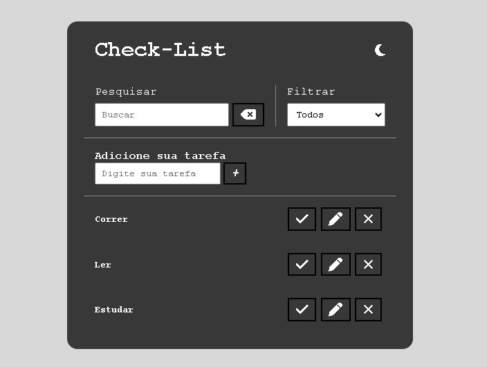

## Preview

 

## 💻Projeto

É uma lista de tarefas que oferece as funções essenciais de adicionar, excluir, editar, pesquisar e filtar tarefas, além de permitir aos usuarios personalizarem sua experiencia com a funcionalidade de mudança de tema.Uma característica importante é a capacidade de salvar informações no navegador para facilitar o acesso aos dados. Tornando a gestão de tarefas diarias simples e eficaz.

## 🔨Funcionalidades do projeto

- Adicionar Tarefas: Os usuários podem inserir novas tarefas de forma rápida e fácil.

- Excluir Tarefas: Permite aos usuários remover tarefas concluídas ou não desejadas.

- Editar Tarefas: Os usuários podem fazer alterações nas tarefas existentes

- Pesquisar Tarefas: Uma função de pesquisa que ajuda os usuários a encontrar tarefas específicas com base em palavras-chave.

- Filtrar Tarefas: Os usuários podem aplicar filtros para organizar em tarefas feitas, não feitas ou todas as tarefas

- Mudança de Tema: Permite personalizar a aparência da aplicação com diferentes temas ou esquemas de cores.

- Salvar no Navegador: Os dados das tarefas podem ser salvos localmente no navegador, garantindo a persistência das informações, mesmo após o fechamento da aplicação.

## 🚀Tecnologias

Esse foi desevolvido com as seguintes tecnologias :

- HTML
- CSS
- JS

## 🤵Autor

 
Feito por <a href="https://github.com/guilhermeHenrique08">Guilherme Henrique 🚀</a>

## 📝 Licença

Este projeto esta sobe a licença [MIT](./LICENSE).
Feito com ❤️ por Guilherme 👋🏽 [Entre em contato!](https://www.linkedin.com/in/guilherme-marques-68aa16267/)
